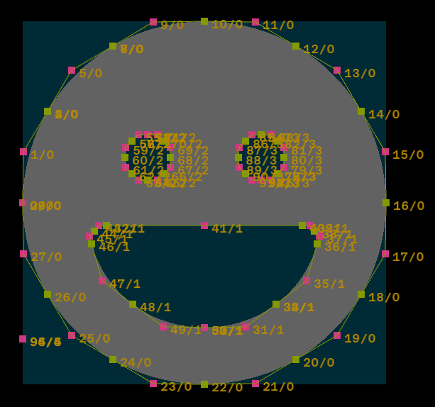

# TTF Rendering Investigation
Parses TTF files and renders glyphs from the contained font.

## Progress Screenshot

## Demo
https://github.com/user-attachments/assets/a6e2a174-1f1a-4b69-9bba-91d682c6901c

## TODO
- :black_square_button: Support composite glyphs.
- 🔲 Fix a bug where the bottom of some letters (B, P, R) aren't rendered.
